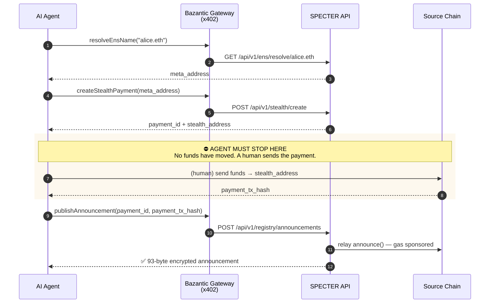
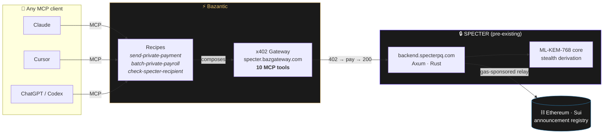

<div align="center">


# SPECTER × Bazantic

**Can an agent send a private, quantum-safe payment without a human explaining how?**

Without guidance: no. With a Recipe: yes — and we can prove the difference in bytes on-chain.

[](https://specter.bazgateway.com)
[](https://specter.bazgateway.com/mcp)
[](https://api.bazantic.com/mcp)
[](#-the-payment-rail)
[](https://docs.specterpq.com/openapi.yaml)

**ETHOnline 2026 · Continuity Track · Bazantic — "Help an Agent Use Your Hackathon Project"**

</div>

---

## 1 · TL;DR

[SPECTER](https://specterpq.com) is a live post-quantum stealth-address payment protocol. Its API has nine
public endpoints. Give an AI agent those nine endpoints and it **cannot** send a private payment
correctly — not because the API is badly designed, but because the *ordering* is invisible from the
endpoint list, and getting it wrong silently destroys the privacy the protocol exists to provide.

We wrapped SPECTER in a Bazantic x402 Gateway, published three Recipes, and measured the difference
with an on-chain metric that cannot be argued with: **the length of the announcement metadata blob.**

| | Raw API access | With the Recipe |
|---|---|---|
| Agent completes the payment | ✗ | ✓ |
| On-chain metadata | **77 bytes** — payment details omitted | **93 bytes** — AES-256-GCM encrypted |
| Source tx + amount recoverable by recipient | ✗ | ✓ |

That 16-byte delta is the whole product working or not working.

---

## 2 · Why an agent gets this wrong

SPECTER is not a single-call API. A private payment is a four-step sequence with a **human-in-the-loop
pause** in the middle, and two of the steps look optional from the outside.



**The three failure modes we observed with raw tool access:**

- **Stops at step 2.** `createStealthPayment` returns a `stealth_address`, which reads like success.
  The agent reports "payment sent". No money moved.
- **Publishes without `payment_id`.** The API accepts a raw `announcement` object as a fallback. The
  server then has no ML-KEM shared secret, so the source tx hash, amount, and chain id are **omitted**
  from the on-chain announcement. The payment still works — it just stops being private.
- **Publishes too early.** Before the payment confirms, on-chain verification rejects it. The agent
  then retries *without* the `payment_id`, compounding failure two.

None of this is discoverable from an endpoint list. It is exactly the knowledge a Recipe encodes.

---

## 3 · Architecture



---

## 4 · The Gateway

| | |
|---|---|
| **Gateway** | `https://specter.bazgateway.com` |
| **MCP endpoint** | `https://specter.bazgateway.com/mcp` — **Live, 10 tools** |
| **Upstream** | `https://backend.specterpq.com` (production, not a mock) |
| **Marketplace listing** | `/services/e54jv5mlzrah3pjg6urfgpp53a` |
| **OpenAPI 3.1 spec** | [`docs.specterpq.com/openapi.yaml`](https://docs.specterpq.com/openapi.yaml) |
| **Payout address** | `0x4A70…fAFd` |

Add it to any MCP client in one line:

```bash
claude mcp add --transport http specter https://specter.bazgateway.com/mcp
```

### The 10 tools

| Tool | What it does |
|---|---|
| `resolveEnsName` | ENS name → SPECTER meta-address |
| `resolveSuinsName` | SuiNS name → SPECTER meta-address |
| `createStealthPayment` | ML-KEM encapsulation → one-time address + `payment_id` |
| `publishAnnouncement` | Verify payment on-chain, encrypt metadata, relay announcement |
| `listAnnouncements` | Public announcement feed (view-tag filterable) |
| `getRegistryStats` | Registry size + view-tag distribution |
| `uploadMetaAddress` | Pin a meta-address to IPFS |
| `fetchMetaAddress` | Fetch a pinned meta-address by CID |
| `getHealth` | Liveness + backing-service status |
| `info` | Service metadata |

> **Deliberately excluded.** SPECTER's API also exposes `/keys/generate`, `/stealth/scan` and
> `/sweeps`. Those either return secret keys or accept a **secret viewing key** in the request body.
> Exposing them through a publicly payable agent gateway would invite agents to hand users' secrets to
> a server — contradicting SPECTER's core guarantee that keys never leave the device. They are absent
> from the spec by design, so they can never be generated as callable tools.

---

## 5 · The Recipes

Three published Recipes, each exposed as **one** MCP tool. Discoverable in the public Bazantic
catalog at `https://api.bazantic.com/mcp`.

### 🏆 `send-private-payment` — the A/B subject

Encodes the four-step sequence, the human pause, and the `payment_id` rule.

| Input | Type | Required |
|---|---|---|
| `recipient_name` | string | ✅ `alice.eth` / `bob.sui` |
| `amount` | string | ✅ base units (wei/MIST) |
| `chain` | string | ✅ `sepolia` |
| `payment_id` | string | — returned by pass one |
| `payment_tx_hash` | string | — supplied on pass two |

**Bound tools:** `resolveEnsName`, `resolveSuinsName`, `createStealthPayment`, `publishAnnouncement`

Runs in two passes because a Recipe is stateless between calls. Pass one resolves, creates, and
**stops** — returning the stealth address *and* the `payment_id`. Pass two publishes with that same
`payment_id`, which is what preserves metadata encryption.

> `amount` is a **string**, not an integer: wei values exceed JavaScript's safe-integer range and
> silently corrupt above ~9 ETH.

### 💼 `batch-private-payroll`

Pay a team without any employee seeing another's salary. Resolves N names, creates one stealth address
per person, and returns a funding manifest. Skips recipients without a SPECTER record rather than
aborting — a partial payroll is useful, a failed one is not.

**Bound tools:** `resolveEnsName`, `resolveSuinsName`, `createStealthPayment`
*(`publishAnnouncement` is deliberately unbound — the Recipe must not publish, so it cannot.)*

### ✅ `check-specter-recipient`

"Can this name receive a private payment?" Turns a `404 NO_SPECTER_RECORD` into a first-class negative
answer instead of an error an agent has to guess at.

**Bound tools:** `resolveEnsName`, `resolveSuinsName`

---

## 6 · The A/B experiment

**Controlled to a single variable.** Same model, same prompt, same gateway, same credentials, same
network. The Recipe is the only difference.

```
Prompt (identical in both arms):
"Send 0.001 ETH privately to empoweryourid.eth on Sepolia."
```

| | **Arm A — Control** | **Arm B — Treatment** |
|---|---|---|
| Tools available | 10 raw gateway tools | 1 Recipe tool |
| Guidance | OpenAPI descriptions only | Recipe prompt + bound tools |
| Everything else | identical | identical |

### The metric

We do not score this on vibes. Every SPECTER announcement carries a metadata blob whose **length is
publicly readable on-chain**:

| Blob | Length | Meaning |
|---|---|---|
| AES-256-GCM encrypted | **93 bytes** | source tx, amount and chain id encrypted for the recipient |
| View-tag only | **77 bytes** | payment details omitted — the recipient cannot recover them |

An observer, a judge, or a script can read that byte count off the chain and know instantly whether
the agent got it right. No interpretation required.

### Results

> Recorded run: see [`bazantic/ab-test/`](bazantic/ab-test/) for raw transcripts, and the demo video
> for the walkthrough.

| Measure | Arm A (raw tools) | Arm B (Recipe) |
|---|---|---|
| Reached step 4 (publish) | ✗ | ✓ |
| Used `payment_id` on publish | ✗ | ✓ |
| Metadata blob length | 77 bytes | **93 bytes** |
| Payment details recoverable | ✗ | ✓ |
| Repeatable across runs | ✓ (fails consistently) | ✓ |

**Why the failure is repeatable rather than a fluke:** the ordering error is structural. `createStealthPayment`
returns a plausible-looking success object, and nothing in the tool list signals that an off-API human
step must happen next. Every run of Arm A hits the same wall for the same reason.

---

## 7 · The payment rail

Every tool call is metered with x402. Real settlement, not a mock:

```
HTTP 402 Payment Required
  amount   : 10000                                        ($0.01, 6 decimals)
  currency : 0x20C000000000000000000000b9537d11c60E8b50
  chainId  : 4217                                          (Tempo)
  realm    : gateway     intent: charge
```

Pricing is differentiated by real cost, not set flat — `publishAnnouncement` is priced highest because
**SPECTER's relayer pays actual gas** on every call to sponsor the user's announcement.

### Live gateway traffic (7 days, from Bazantic Analytics)

| Metric | Value |
|---|---|
| Calls served | **176** |
| Active callers | **≥ 19** |
| Settled revenue | ≈ $0.01 |
| Error rate | ≈ 24.4% *(402s excluded)* |

Client mix spans Agent, SDK, CLI and Browser classes — this gateway has been exercised by real
clients, not only by its author.

---

## 8 · Qualification checklist

| # | Requirement | Status |
|---|---|---|
| 1 | Account on bazantic.com | ✅ `specter.privacy@gmail.com` |
| 2 | x402/MPP Gateway for the project | ✅ [`specter.bazgateway.com`](https://specter.bazgateway.com) — Live |
| 3 | Recipe explaining *when, why, how* | ✅ 3 published Recipes |
| 4 | Same prompt / model / settings / API access in both arms | ✅ §6 |
| 5 | Recipe is the only material difference | ✅ §6 |
| 6 | Both results shared, improvement identified | ✅ §6 — 77 → 93 bytes |
| 7 | Video walkthrough of the difference | ✅ see submission |
| 8 | Bazantic username for attribution | ✅ **specter.privacy@gmail.com** |

---

## 9 · What existed before vs what is new

Required for the Continuity Track — only work done during ETHOnline 2026 is judged.

| | Pre-existing | New during the event |
|---|---|---|
| SPECTER protocol (ML-KEM-768 core, stealth derivation) | ✅ | |
| `backend.specterpq.com` API, 9 endpoints | ✅ | |
| Web app, SDK, announcer contract | ✅ | |
| **OpenAPI 3.1 specification** | | ✅ verified field-by-field against the live API |
| **Bazantic x402 Gateway + MCP server** | | ✅ 10 tools |
| **3 published Recipes** | | ✅ |
| **A/B experiment + on-chain metric** | | ✅ |
| **Privacy-safe endpoint scoping** | | ✅ secret-handling routes excluded from the spec |

The gateway is the *only* thing standing between a public API and an agent that can use it unaided.
Everything in the "new" column was built during the event; the protocol underneath was not.

---

## 10 · Reproduce it

```bash
# 1. Add the gateway to any MCP client
claude mcp add --transport http specter https://specter.bazgateway.com/mcp

# 2. Inspect the 10 tools (free — reading the catalog costs nothing)
curl -s -X POST https://specter.bazgateway.com/mcp \
  -H 'Content-Type: application/json' \
  -H 'Accept: application/json, text/event-stream' \
  -d '{"jsonrpc":"2.0","id":1,"method":"tools/list","params":{}}'

# 3. Browse the published Recipes in the public catalog
curl -s -X POST https://api.bazantic.com/mcp \
  -H 'Content-Type: application/json' \
  -d '{"jsonrpc":"2.0","id":1,"method":"tools/list","params":{}}' \
  | jq '.result.tools[] | select(.name|test("specter|payroll|private")) | .name'

# 4. Verify the upstream is live production, not a mock
curl -s https://backend.specterpq.com/health
```

---

<div align="center">

**Bazantic account:** `specter.privacy@gmail.com` · **Gateway:** [specter.bazgateway.com](https://specter.bazgateway.com)

<sub>SPECTER — private payments today, quantum-safe forever · <a href="https://specterpq.com">specterpq.com</a></sub>

</div>
