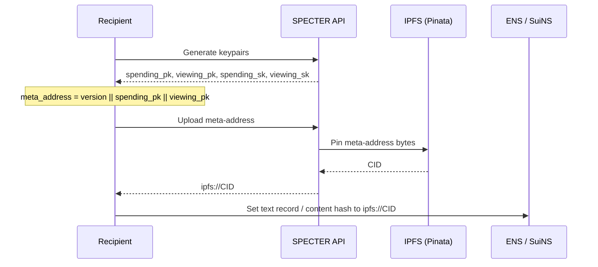
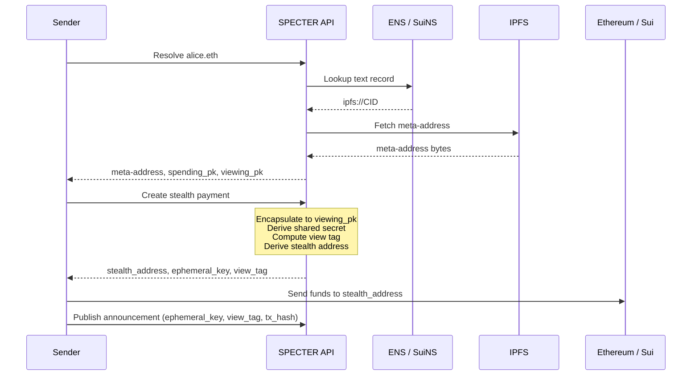
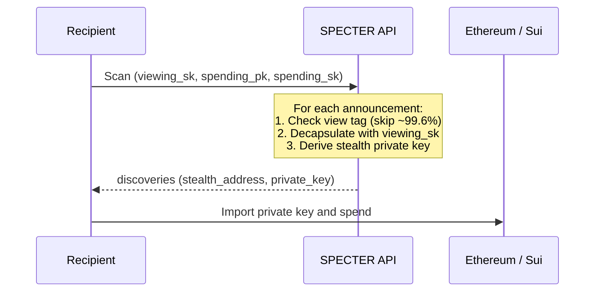

<div align="center">
  

  **Post-quantum stealth address protocol for Ethereum and Sui**

  [Live Demo](https://specter-stealth.vercel.app)

</div>

---

### Table of contents

- [About](#about)
- [SPECTER vs existing protocols](#specter-vs-existing-protocols)
- [How it works](#how-it-works)
- [Use cases and roadmap](#use-cases-and-roadmap)
- [Tech stack](#tech-stack)
- [Project structure](#project-structure)
- [Getting started](#getting-started)

---

## About

On-chain payments today are fully transparent. Every transfer exposes both the sender and recipient, making wallets easy to track and link to real identities.

SPECTER fixes this. Send to anyone using just their ENS (`.eth`) or SuiNS (`.sui`) name, and SPECTER generates a fresh, one-time stealth address for every payment. The recipient is the only one who can discover and spend from it. To the rest of the world, it looks like funds went to a random address with no connection to anyone.

The cryptography underneath uses [**ML-KEM-768**](https://nvlpubs.nist.gov/nistpubs/FIPS/NIST.FIPS.203.pdf) (NIST FIPS 203), a post-quantum key encapsulation standard. This means payments stay private even against adversaries with access to quantum computers.

SPECTER also integrates with [**Yellow Network**](https://www.yellow.org/) to enable private trading through off-chain state channel settlement, combining stealth addresses with high-performance order execution.

---

## SPECTER vs existing protocols

Stealth address protocols like Umbra and Fluidkey exist today on EVM chains. They work well, but share two limitations:

|  | SPECTER | Umbra | Fluidkey |
|--|---------|-------|----------|
| **Cryptography** | ML-KEM-768 (post-quantum) | ECDH (secp256k1) | ECDH (secp256k1) |
| **Quantum resistant** | Yes | No | No |
| **Chains** | Ethereum, Sui | Ethereum, Polygon, Optimism, Arbitrum, Gnosis | Ethereum, Base, Optimism, Arbitrum, Polygon, Gnosis |
| **Non-EVM support** | Sui (live) | No | No |
| **View tags** | Yes (skips ~99.6% of announcements) | Yes (v2) | N/A (server-generated addresses) |
| **Scan performance** | ~1-2s for 100k announcements | 10-15s for weekly scans | Delegated to trusted third party |
| **Name services** | ENS + SuiNS | ENS | ENS |
| **Meta-address storage** | IPFS | On-chain registry | On-chain registry |

Both Umbra and Fluidkey use ECDH with secp256k1 for key exchange. This is secure against classical computers, but will not survive advances in quantum computing. SPECTER replaces ECDH with ML-KEM-768, a post-quantum key encapsulation mechanism standardized by NIST, ensuring stealth addresses remain private long-term.

Existing solutions also only cover EVM chains. SPECTER supports Ethereum and Sui today with a shared protocol core, and is designed to extend to any chain that supports public-key transfers.

---

## How it works

### 1. Setup (one-time)

Recipient generates ML-KEM-768 spending + viewing keypairs, uploads the meta-address to IPFS, and links it to their ENS or SuiNS name.



### 2. Send

Sender resolves the recipient's name, a stealth address is derived from the meta-address, and the sender transfers funds to that address. An announcement is published so the recipient can discover the payment.



### 3. Receive

Recipient scans announcements using their viewing key. View tags filter out ~99.6% of irrelevant entries. Matching payments yield the stealth private key, which can be imported into any wallet to spend.



---

## Use cases and roadmap

### Live now

- **Private payments** on Ethereum and Sui. Send and receive through stealth addresses using ENS or SuiNS names.

- **Private trading** via [Yellow Network](https://www.yellow.org/). Settle trades off-chain through state channels without exposing wallet addresses or trading history.

### Coming soon

- **More chains** : Arbitrum, Base, Optimism, Solana, Hyperliquid

- **Prediction markets** : Participate without linking your identity to positions or payouts. Each bet and payout goes through an isolated stealth address.

- **Payroll and grants** : Pay contributors privately. Compensation details stay invisible to the public and other team members.

- **Donations** : Fund causes or individuals without creating a public link between your wallet and the recipient. Useful for whistleblower funding, activist support, or any context where both parties benefit from privacy.

- **OTC deals** : Large transfers between parties stay private. No one watching the chain can figure out who paid whom.

---

## Tech stack

### Backend (Rust)

The protocol deals with key generation, encapsulation, stealth derivation, and scanning. These are security-critical operations where memory safety, constant-time execution, and performance matter. Rust enforces all of this at compile time. Secret keys are zeroized on drop. A single implementation is shared across the API server and CLI, so there's one place to audit.

- **Axum** for the REST API server
- **pqcrypto-kyber** for ML-KEM-768 key encapsulation
- **sha3** for SHAKE256 hashing and view tag computation
- **k256** for secp256k1 Ethereum address derivation from stealth keys
- **blake2** for BLAKE2b-256 hashing used in Sui address generation
- **zeroize** + **subtle** for secure memory clearing and constant-time comparisons
- **alloy** for Ethereum and ENS interactions
- **@mysten/sui** for Sui and SuiNS interactions
- **IPFS (Pinata)** for storing and fetching meta-addresses. Name services point to an IPFS CID, keeping on-chain storage minimal
- **dashmap** for lock-free concurrent caching

### Frontend (React + Vite)

Wallet interactions, name resolution, and transaction signing need a rich client. The frontend delegates all cryptography to the backend over HTTP.

- **React + Vite + TypeScript** for the UI
- **TailwindCSS** + **Radix UI** for styling and accessible component primitives
- **Dynamic Labs** for EVM wallet connection (MetaMask, WalletConnect, etc.)
- **@mysten/dapp-kit** for Sui wallet connection
- **viem** for Ethereum transaction building and verification
- **Framer Motion** + **GSAP** for animations
- **react-hook-form** + **Zod** for form handling and schema validation

---

## Project structure

This is a monorepo with two main parts: a **Rust backend** that handles all cryptography, protocol logic, and chain interactions, and a **React frontend** that provides the user-facing application.

```
SPECTER/
├── specter/                  # Rust workspace
│   ├── specter-api/          # REST API server (Axum)
│   ├── specter-cli/          # CLI tool
│   ├── specter-core/         # Shared types, errors, constants
│   ├── specter-crypto/       # ML-KEM-768, SHAKE256, stealth derivation
│   ├── specter-stealth/      # Payment creation and discovery
│   ├── specter-registry/     # Announcement storage
│   ├── specter-scanner/      # Batch scanning
│   ├── specter-ens/          # ENS resolution
│   ├── specter-suins/        # SuiNS resolution
│   └── specter-yellow/       # Yellow Network state channel integration
├── SPECTER-web/              # React frontend
│   └── src/
│       ├── pages/            # Setup, Send, Scan, Yellow, Use Cases
│       ├── lib/              # API client, wallet utils, tx verification, Yellow services
│       └── components/       # UI components
└── scripts/                  # Build, test, E2E scripts
```

---

## Getting started

Requires **Rust** (latest stable) and **Node.js** v18+.

```bash
git clone https://github.com/pranshurastogi/SPECTER.git
cd SPECTER
```

### Backend

```bash
cd specter
cp .env.example .env        # fill in RPC URLs, Pinata keys, etc.
cargo build --release
cargo run --bin specter -- serve --port 3001
```

API will be available at `http://localhost:3001`.

### Frontend

```bash
cd SPECTER-web
cp .env.example .env        # set VITE_API_BASE_URL if needed
npm install
npm run dev
```

### Tests

```bash
cd specter
cargo test
```

---

<p align="center">
  Built for ETHGlobal HackMoney 2026
</p>
