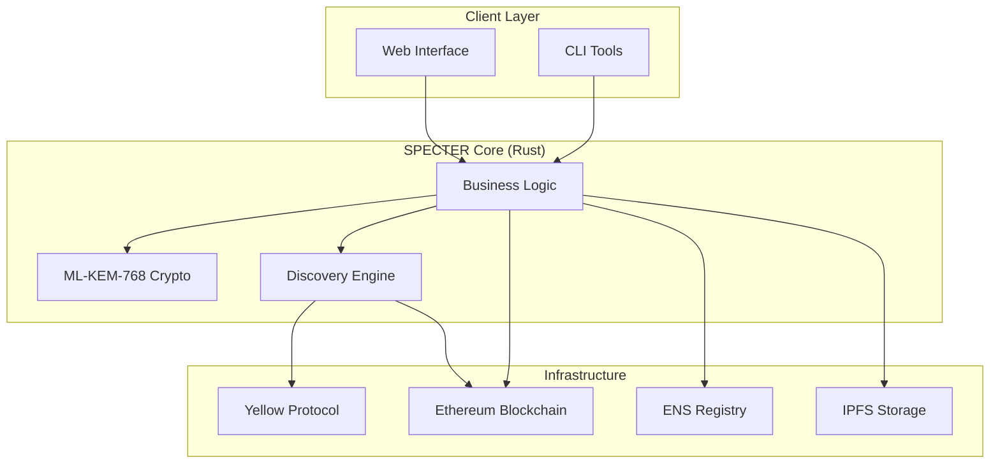

<div align="center">
  
</div>

# SPECTER

SPECTER is a post-quantum stealth address protocol built for Ethereum. It enables private payments through ENS names while ensuring long-term security against quantum computing threats. By utilizing NIST-standardized **ML-KEM-768** cryptography, SPECTER provides a privacy layer that is secure today and future-proof for the quantum era.

Unlike traditional privacy solutions that rely on elliptic curve cryptography (vulnerable to Shor's algorithm), SPECTER is designed from the ground up for post-quantum resistance. It achieves high scanning efficiency through view tag optimization and supports private off-chain settlements via the Yellow protocol.

---

## Key Features

- **Post-Quantum Security**: Implements ML-KEM-768 (Kyber) for quantum-resistant key encapsulation.
- **Stealth Addresses**: distinct, one-time addresses for every transaction, preventing observers from linking payments to a recipient's identity.
- **ENS Integration**: Send funds directly to readable names like `bob.eth` without exposing the recipient's main address.
- **High Efficiency**: Uses view tags to reduce scanning overhead by approximately 99.6%, enabling fast client-side syncing.
- **Off-Chain Privacy**: Integrates with Yellow state channels for private trading and settlement.

---

## System Architecture

The following diagram illustrates the interaction between the user clients, the core Rust logic, and external infrastructure.



## Getting Started

### Prerequisites

- **Rust**: Latest stable version
- **Node.js**: v18 or higher
- **Yarn** or **NPM**

### Installation

1.  **Clone the repository**
    ```bash
    git clone https://github.com/your-username/SPECTER.git
    cd SPECTER
    ```

2.  **Build the Backend (Rust)**
    ```bash
    cd specter-backend
    cargo build --release
    ```

3.  **Run the Frontend (Next.js)**
    ```bash
    cd ../SPECTER-web
    npm install
    npm run dev
    ```

## Usage Workflow

1.  **Registration**: A user generates a spending and viewing keypair locally. The public metadata is uploaded to IPFS and linked to their ENS name.
2.  **Sending**: A sender resolves the recipient's ENS name, retrieves the metadata, and generates a stealth address and ephemeral key. The funds are sent to the stealth address, and the ephemeral key is broadcast to the registry.
3.  **Receiving**: The recipient scans the registry using their viewing key. If a payment matches, they can reconstruct the private key for the stealth address and claim the funds.

## Technology Stack

-   **Language**: Rust (Core Logic), TypeScript (Frontend)
-   **Cryptography**: `pqcrypto-kyber` (ML-KEM-768), SHA3
-   **Frontend Framework**: Next.js, TailwindCSS
-   **Infrastructure**: Ethereum Mainnet, ENS, IPFS (Pinata), Yellow Protocol

---

<p align="center">
  Built for ETHGlobal HackMoney 2026
</p>
