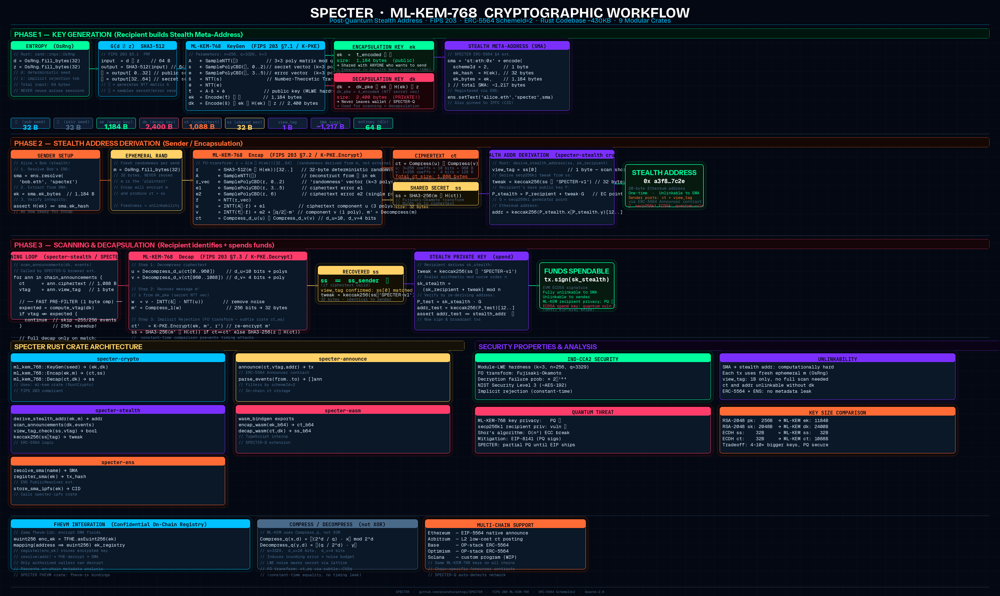
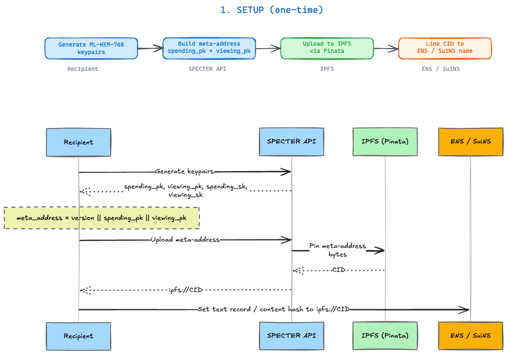
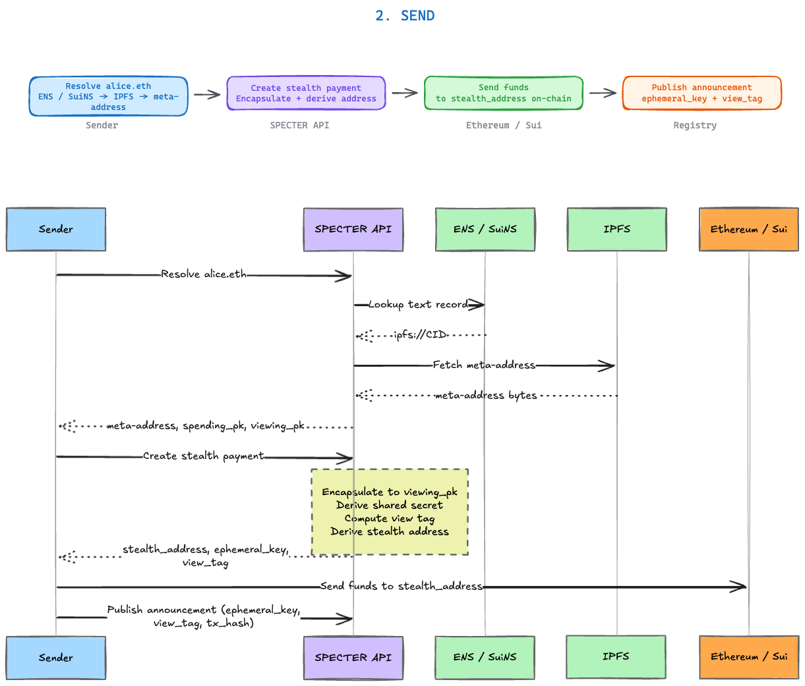
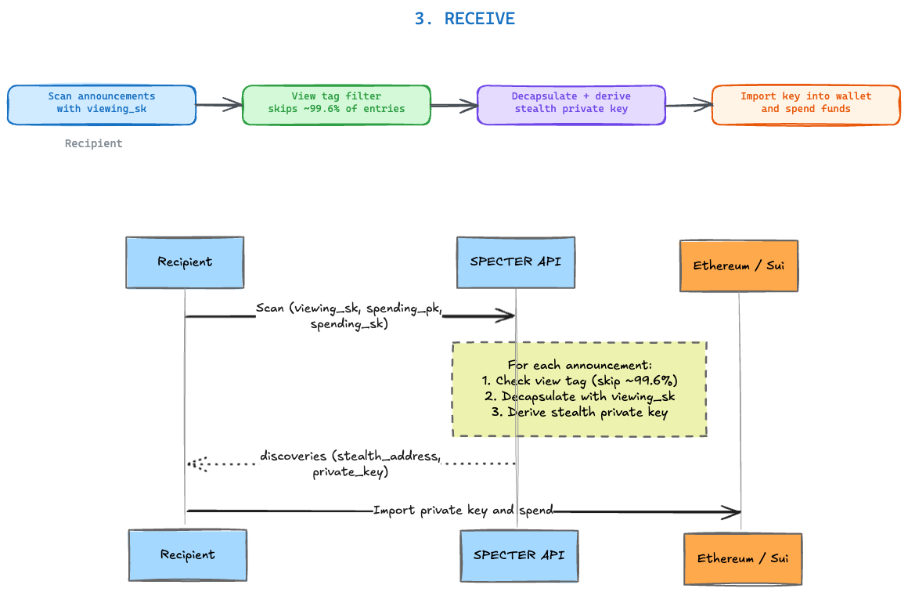
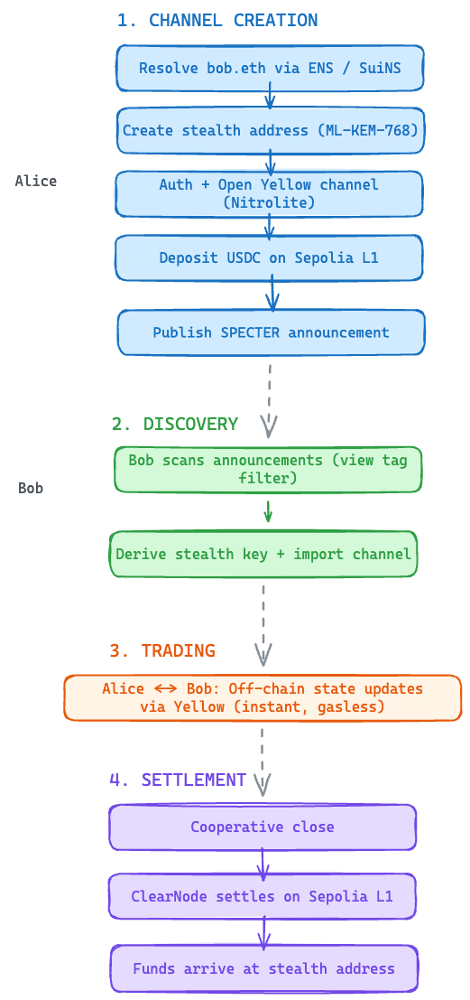
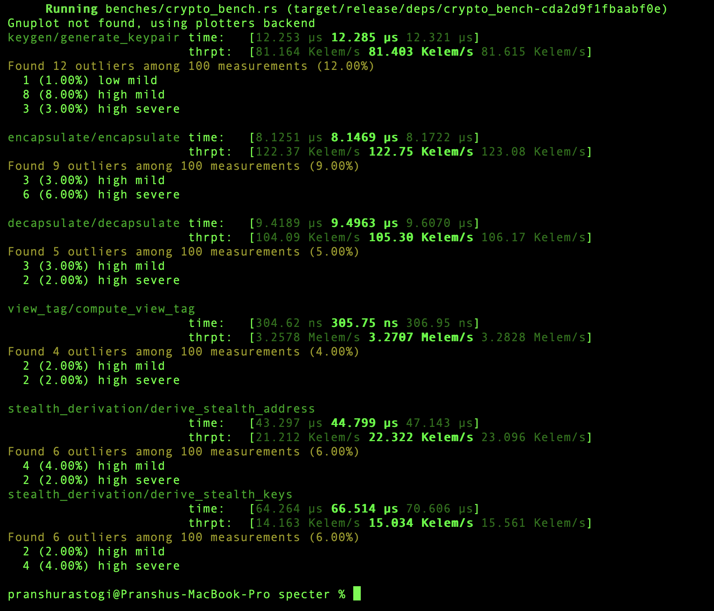

<div align="center">
  

  <br/>
  <br/>

  **Post-Quantum Stealth Address Protocol**

  *Privacy that survives the quantum era.*

  <br/>

  [](https://specterpq.com)
  [](https://twitter.com/SpecterPQ)
  [](https://docs.specterpq.com)
  [](https://arxiv.org/pdf/2501.13733v1)

  <br/>

  

</div>

---

## The Problem

Blockchain payments are fully transparent by design. Every transfer permanently exposes the sender, recipient, amount, and timing, all linkable onchain forever.
Also, with the development in quantum computers, current algorithm are at risk.

This creates real world consequences:

- **$3.8B stolen** in crypto in 2023 alone — on-chain visibility makes high-value wallets easy targets
- **Zero financial privacy** — your employer, counterparty, or competitor can track every payment you send or receive
- **Quantum threat on the horizon** — the NSA and NIST both project cryptographically relevant quantum computers within 10–15 years. Every ECDH based privacy protocol deployed today will be retroactively broken. Adversaries are already harvesting encrypted data to decrypt later ("harvest now, decrypt later")
- **Existing solutions don't scale** — Umbra and Fluidkey solve privacy today but use secp256k1 ECDH, which is broken by Shor's algorithm on a sufficiently powerful quantum computer

> *"Store now, decrypt later attacks mean data encrypted today may be vulnerable tomorrow."*
> — CISA, NSA Joint Advisory, 2022

SPECTER solves all three problems simultaneously.

---

## What is SPECTER?

SPECTER is a **post-quantum stealth address protocol** that lets anyone send private payments on Ethereum and Sui using just an ENS (`.eth`) or SuiNS (`.sui`) name.

Every payment generates a **fresh, one time stealth address**. To the blockchain, it looks like funds went to a random address with no connection to anyone. Only the intended recipient using their private viewing key  can discover and spend from it.

The cryptography is built on **ML-KEM-768** (NIST FIPS 203), the post-quantum key encapsulation standard, replacing the ECDH used by every other stealth protocol today. Payments stay private not just now — but against adversaries with quantum computers.

<div align="center">
  
  <br/>
  <sub>ML-KEM-768 key encapsulation flow used in SPECTER</sub>
</div>

---

## SPECTER vs Existing Protocols

|  | **SPECTER** | **Umbra** | **Fluidkey** |
|--|:-----------:|:---------:|:------------:|
| **Cryptography** | ML-KEM-768 (NIST FIPS 203) | ECDH secp256k1 | ECDH secp256k1 |
| **Quantum resistant** | ✅ Yes | ❌ No | ❌ No |
| **Harvest-now-decrypt-later safe** | ✅ Yes | ❌ No | ❌ No |
| **Non-EVM chains** | ✅ Sui (live) | ❌ No | ❌ No |
| **Name service support** | ENS + SuiNS | ENS only | ENS only |
| **View tags (scan efficiency)** | ✅ ~99.6% skip rate | ✅ v2 only | ❌ Server-delegated |
| **Scan performance (100k ann.)** | ~1–2s | 10–15s | Delegated to 3rd party |
| **Self-sovereign** | ✅ Fully | ✅ Yes | ❌ Trusted server |
| **Meta-address storage** | IPFS (decentralised) | On-chain | On-chain |
| **Private trading** | ✅ Yellow Network | ❌ | ❌ |
| **Open source** | ✅ | ✅ | ❌ |

Both Umbra and Fluidkey use ECDH with secp256k1. This is secure today, but broken by Shor's algorithm on a sufficiently capable quantum computer. SPECTER replaces ECDH entirely with ML-KEM-768 — a lattice-based key encapsulation mechanism that has no known quantum attack. Your transaction history remains private permanently.

---

## How It Works

### Overview

```
Recipient                           Sender                          Blockchain
─────────                           ──────                          ──────────
Generate ML-KEM-768 keypair    →    Resolve ENS/SuiNS
Upload meta-address to IPFS    →    Fetch meta-address from IPFS
Link CID to ENS/SuiNS          →    Encapsulate shared secret (ML-KEM-768)
                                    Derive stealth address
                                    Send funds                  →   Stealth address funded
                                    Publish announcement        →   Announcement in registry
Scan with viewing key          ←    ─────────────────────────────────────────
Compute view tag match
Derive stealth private key
Spend from stealth address
```

---

### Step 1 — Setup (One-Time)

The recipient generates two ML-KEM-768 keypairs: a **spending keypair** and a **viewing keypair**. Together they form a **meta-address**, which is uploaded to IPFS and linked to their ENS or SuiNS name via a text record.

<div align="center">
  
</div>

```
spending_pk + viewing_pk  →  meta-address  →  IPFS CID  →  ENS text record
```

The private keys never leave the user's device. The meta-address is public by design — it reveals nothing about payment history.

---

### Step 2 — Send

The sender resolves the recipient's ENS name, fetches the meta-address from IPFS, and runs the ML-KEM-768 encapsulation. This produces:

1. A **shared secret** — used to derive the stealth address
2. A **ciphertext (ephemeral key)** — published on-chain so the recipient can recover the secret

The sender transfers funds to the derived stealth address and publishes an **announcement** to the SPECTER registry containing the ephemeral key and a **view tag** (1 byte derived from the shared secret).

<div align="center">
  
</div>

The view tag allows recipients to skip ~99.6% of all announcements during scanning — a 256× speedup — without revealing which announcements belong to them.

---

### Step 3 — Receive

The recipient scans announcements using their viewing key. For each announcement:

1. **View tag check** — eliminates ~99.6% instantly
2. **ML-KEM decapsulation** — recovers the shared secret from the ciphertext
3. **Stealth key derivation** — derives the private key for that stealth address

If a match is found, the recipient holds the private key to that address and can spend from it in any Ethereum or Sui wallet.

<div align="center">
  
</div>

**Performance:** Scanning 100,000 announcements takes ~1–2 seconds on a standard machine — compared to 10–15 seconds for Umbra's weekly scans.

---

### Yellow Network Integration

SPECTER integrates with [Yellow Network](https://www.yellow.org/) to enable **private trading** through off-chain state channel settlement.

<div align="center">
  
</div>

- Open a private payment channel to a stealth address
- Execute trades off-chain with no on-chain footprint
- Settle final balances on-chain when the channel closes
- Supported chains: Ethereum Sepolia, Base Sepolia, Polygon Amoy (testnet); Ethereum, Base, Polygon, BNB, Linea, World Chain (mainnet)

---

## Architecture

```
SPECTER/
├── specter/                        # Rust workspace (backend)
│   ├── specter-api/                # Axum REST API server
│   │   ├── src/handlers.rs         # Route handlers
│   │   ├── src/middleware.rs       # Rate limiting, auth, security headers
│   │   └── src/state.rs            # AppState, RegistryBackend (Memory | SQLite)
│   ├── specter-cli/                # CLI — keygen, scan, serve
│   ├── specter-core/               # Shared types: Announcement, MetaAddress, errors
│   ├── specter-crypto/             # ML-KEM-768 encap/decap, SHAKE256, view tags
│   ├── specter-stealth/            # Stealth address creation + payment discovery
│   ├── specter-registry/           # Announcement storage
│   │   ├── src/memory.rs           # In-memory registry (dev)
│   │   ├── src/file.rs             # File-backed registry
│   │   └── src/sqlite/             # SQLite registry (production)
│   │       ├── registry.rs         # AnnouncementRegistry impl + LRU cache
│   │       ├── scan.rs             # Per-wallet scanner checkpoints
│   │       └── yellow.rs           # Yellow channel lifecycle store
│   ├── specter-scanner/            # Batch scanning engine
│   ├── specter-ens/                # ENS resolution (Ethereum)
│   ├── specter-suins/              # SuiNS resolution (Sui)
│   └── specter-yellow/             # Yellow Network state channel integration
└── SPECTER-web/                    # React frontend
    └── src/
        ├── pages/                  # Setup, Send, Scan, Yellow, Use Cases
        ├── lib/
        │   ├── api.ts              # Type-safe REST client
        │   ├── blockchain/         # viem, ENS, SuiNS, tx verification
        │   └── yellow/             # Yellow client, config, balances
        └── components/             # UI components (Radix UI + Tailwind)
```

### Registry Backends

| Backend | Use case | Config |
|---------|----------|--------|
| Memory | Development, testing | `REGISTRY_BACKEND=memory` (default) |
| SQLite (WAL mode) | Production | `REGISTRY_BACKEND=sqlite` + `REGISTRY_SQLITE_PATH=/data/specter.db` |

The SQLite backend runs in WAL mode with a 256-slot LRU cache per view tag, scanner checkpoints for incremental restarts, and Yellow channel lifecycle tracking.

---

## Tech Stack

### Backend — Rust

Security-critical operations (key generation, encapsulation, stealth derivation, scanning) require memory safety, constant-time execution, and raw performance. Rust enforces all of this at compile time.

| Crate | Purpose |
|-------|---------|
| `ml-kem` (RustCrypto) | ML-KEM-768 encapsulation — NIST FIPS 203 compliant, pure Rust, WASM-compatible |
| `sha3` | SHAKE256 for shared secret hashing and view tag computation |
| `k256` | secp256k1 Ethereum address derivation from stealth keys |
| `blake2` | BLAKE2b-256 for Sui address generation |
| `zeroize` | Secure memory zeroization of secret keys on drop |
| `subtle` | Constant-time comparisons to prevent timing side-channels |
| `axum` | Async REST API server |
| `sqlx` | Async SQLite (WAL mode, connection pooling) |
| `alloy` | Ethereum RPC, ENS interaction |
| `dashmap` | Lock-free concurrent caching |
| `lru` | LRU cache for hot announcement lookups |

### Frontend — React + TypeScript

| Library | Purpose |
|---------|---------|
| Vite + React + TypeScript | UI framework |
| TailwindCSS + Radix UI | Styling and accessible components |
| Dynamic Labs | EVM wallet connection (MetaMask, WalletConnect, etc.) |
| `@mysten/dapp-kit` | Sui wallet connection |
| viem | Ethereum tx building and verification |
| react-hook-form + Zod | Form handling and schema validation |
| Framer Motion + GSAP | Animations |

---

## Performance

<div align="center">
  
</div>

| Operation | Performance |
|-----------|-------------|
| ML-KEM-768 key generation | < 1ms |
| Stealth address creation (encapsulation) | < 2ms |
| View tag check (per announcement) | ~0.5µs |
| Full scan — 100k announcements | ~1–2s |
| SQLite announcement publish | < 5ms |
| Registry lookup by view tag (cached) | < 1ms |

View tags give a **~256× speedup** on scanning — only 1 in 256 announcements needs full ML-KEM decapsulation. Scan 10 million announcements in roughly 20 seconds on a standard VPS.

---

## API Reference

Base URL: `https://backend.specterpq.com` (production) or `http://localhost:3001` (local)

| Method | Endpoint | Description |
|--------|----------|-------------|
| `GET` | `/health` | Health check + uptime |
| `POST` | `/api/v1/keys/generate` | Generate ML-KEM-768 keypair |
| `POST` | `/api/v1/stealth/create` | Create stealth address from meta-address |
| `POST` | `/api/v1/stealth/scan` | Scan announcements for payments |
| `GET` | `/api/v1/ens/resolve/:name` | Resolve ENS → meta-address |
| `GET` | `/api/v1/suins/resolve/:name` | Resolve SuiNS → meta-address |
| `POST` | `/api/v1/ipfs/upload` | Upload meta-address to IPFS (Pinata) |
| `GET` | `/api/v1/registry/announcements` | List announcements (paginated) |
| `POST` | `/api/v1/registry/announcements` | Publish announcement |
| `GET` | `/api/v1/registry/stats` | Registry stats + view tag distribution |
| `POST` | `/api/v1/yellow/channel/create` | Open private Yellow channel |
| `POST` | `/api/v1/yellow/channel/discover` | Discover your channels |
| `POST` | `/api/v1/yellow/transfer` | Off-chain transfer |
| `POST` | `/api/v1/yellow/channel/close` | Close and settle channel |

---

## Getting Started

### Requirements

- **Rust** (latest stable) — [rustup.rs](https://rustup.rs)
- **Node.js** v18+
- **Pinata account** — [pinata.cloud](https://pinata.cloud) (for IPFS meta-address storage)
- **Alchemy or public RPC** — for ENS resolution

### Backend

```bash
git clone https://github.com/pranshurastogi/SPECTER.git
cd SPECTER/specter

cp .env.example .env
# Fill in: ETH_RPC_URL, PINATA_JWT, PINATA_GATEWAY_URL, PINATA_GATEWAY_TOKEN

# Development (in-memory registry)
cargo run -p specter-cli -- serve --port 3001

# Production (SQLite persistence)
REGISTRY_BACKEND=sqlite \
REGISTRY_SQLITE_PATH=/data/specter.db \
cargo run --release -p specter-cli -- serve --port 3001
```

### Frontend

```bash
cd SPECTER/SPECTER-web

cp .env.example .env
# Set VITE_API_BASE_URL to your backend URL

npm install
npm run dev
```

### CLI Commands

```bash
# Generate ML-KEM-768 keypair
specter generate --output keys.json

# Resolve an ENS name
specter resolve vitalik.eth

# Create a stealth payment address
specter create alice.eth

# Scan for incoming payments
specter scan --keys keys.json

# Run API server
specter serve --port 3001
```

### Tests

```bash
# Full workspace (195 tests)
cargo test --workspace

# SQLite persistence tests (25 tests)
cargo test -p specter-registry --features sqlite -- sqlite

# With SQLite + verbose output
cargo test -p specter-registry --features sqlite -- sqlite --nocapture
```

### Docker

```dockerfile
FROM rust:1.83 AS builder
WORKDIR /app
COPY . .
RUN cargo build --release -p specter-api

FROM debian:bookworm-slim
COPY --from=builder /app/target/release/specter-api /usr/local/bin/
VOLUME ["/data"]
ENV REGISTRY_BACKEND=sqlite
ENV REGISTRY_SQLITE_PATH=/data/specter.db
EXPOSE 8080
CMD ["specter-api"]
```

---

## Environment Variables

### Backend (`specter/.env`)

| Variable | Required | Description |
|----------|----------|-------------|
| `ETH_RPC_URL` | Yes | Ethereum RPC (Alchemy, Infura, or public) |
| `PINATA_JWT` | Yes | Pinata JWT for IPFS uploads |
| `PINATA_GATEWAY_URL` | Yes | Pinata dedicated gateway URL |
| `PINATA_GATEWAY_TOKEN` | Yes | Pinata gateway access token |
| `REGISTRY_BACKEND` | No | `sqlite` for production, `memory` for dev (default) |
| `REGISTRY_SQLITE_PATH` | If SQLite | Path to `.db` file |
| `RATE_LIMIT_RPS` | No | Requests per second per IP (default: 10) |
| `RATE_LIMIT_BURST` | No | Burst cap per IP (default: 30) |
| `ALLOWED_ORIGINS` | No | CORS origins (comma-separated) |
| `YELLOW_WS_URL` | No | Yellow Network WebSocket URL |
| `YELLOW_CHAIN_ID` | No | Chain ID for Yellow settlement |

### Frontend (`SPECTER-web/.env`)

| Variable | Required | Description |
|----------|----------|-------------|
| `VITE_API_BASE_URL` | Yes | Backend URL (e.g. `https://backend.specterpq.com`) |
| `VITE_ETH_RPC_URL` | Yes | Ethereum RPC for client-side interactions |
| `VITE_DYNAMIC_ENVIRONMENT_ID` | Yes | Dynamic Labs wallet SDK environment ID |
| `VITE_USE_TESTNET` | No | `true` for Sepolia, `false` for mainnet |

---

## Use Cases

### Live Today

- **Private payments** — Send ETH or tokens to any ENS/SuiNS name. Recipient gets a fresh stealth address every time. No on-chain link between sender and recipient.
- **Private trading** — Open a Yellow Network state channel to a stealth address. Trade off-chain. Settle on-chain with no visible counterparty.

### Coming Soon

| Use Case | How |
|----------|-----|
| **Prediction markets** | Each position and payout routed through isolated stealth addresses |
| **Payroll & grants** | Pay contributors privately — salary invisible to co-workers and public |
| **Donations** | Fund causes without linking your wallet to the recipient |
| **OTC deals** | Large bilateral transfers with no on-chain fingerprint |
| **More chains** | Arbitrum, Base, Optimism, Solana, Hyperliquid |

---

## Research

SPECTER is grounded in published cryptographic research:

- [**Post-Quantum Stealth Address Protocols**](https://arxiv.org/pdf/2501.13733v1) — arXiv 2501.13733
- [**NIST FIPS 203 — ML-KEM Standard**](https://nvlpubs.nist.gov/nistpubs/FIPS/NIST.FIPS.203.pdf) — the post-quantum KEM standard SPECTER is built on
- [**ERC-5564: Stealth Addresses**](https://eips.ethereum.org/EIPS/eip-5564) — Ethereum stealth address standard (SPECTER extends this with post-quantum cryptography)

---

## Security

- All cryptographic operations use **pure Rust** implementations from the [RustCrypto](https://github.com/RustCrypto) project
- Secret keys are **zeroized on drop** using the `zeroize` crate
- Constant-time comparisons use the `subtle` crate — no timing side-channels
- The backend enforces **rate limiting** per IP (configurable via env vars)
- No secret keys ever leave the user's device — the backend handles only public parameters
- SQLite runs in **WAL mode** with foreign key constraints and a 5s busy timeout

To report a vulnerability, email **hello@pranshurastogi.com**.

---

<div align="center">

  

  <br/>

  **[specterpq.com](https://specterpq.com)** · **[@SpecterPQ](https://twitter.com/SpecterPQ)** · **[Docs](https://docs.specterpq.com)** · **[Research Paper](https://arxiv.org/pdf/2501.13733v1)**

  <br/>

  Built with Rust · Powered by ML-KEM-768 · Private by design

</div>
