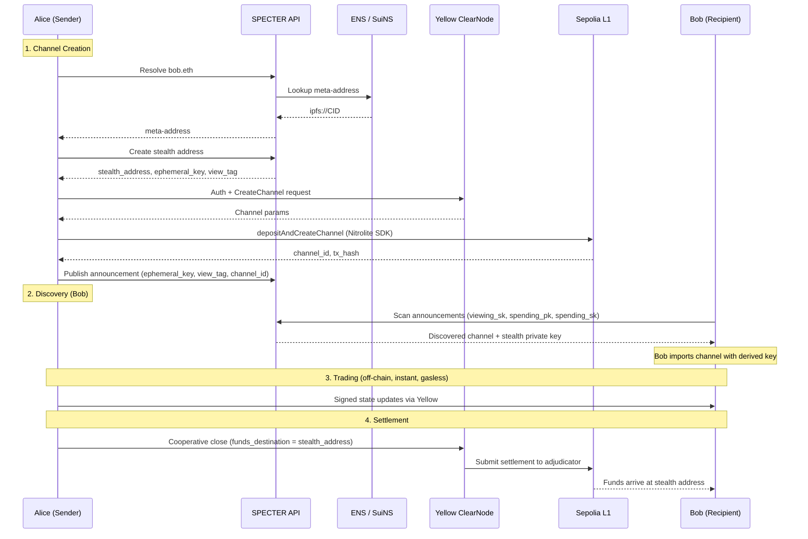

# SPECTER x Yellow Network

**Private state channel trading powered by post-quantum stealth addresses.**

Traditional state channels expose trading relationships on-chain. When Alice opens a channel with Bob, everyone sees that Alice and Bob are trading. SPECTER makes the counterparty unlinkable by routing channels through one-time stealth addresses.

```
Traditional:       Alice ── channel ──> Bob            (visible on-chain)
SPECTER + Yellow:  Alice ── channel ──> 0xStealth      (nobody knows 0xStealth = Bob)
```

---

## How it works



---

## Privacy guarantees

| Property | Guarantee |
|----------|-----------|
| **Unlinkable** | On-chain observer cannot connect stealth address to Bob |
| **Untraceable** | No proof that Alice and Bob are trading |
| **Post-quantum** | ML-KEM-768 (128-bit quantum / 192-bit classical security) |
| **Efficient** | View tags filter 99.6% of announcements during scanning |

---

## Network configuration (Sepolia)

| Parameter | Value |
|-----------|-------|
| WebSocket | `wss://clearnet.yellow.com/ws` |
| Custody contract | `0x019B65A265EB3363822f2752141b3dF16131b262` |
| Adjudicator | `0x7c7ccbc98469190849BCC6c926307794fDfB11F2` |
| Chain | Sepolia (`11155111`) |
| Test token (USDC) | `0x1c7D4B196Cb0C7B01d743Fbc6116a902379C7238` |

---

## API endpoints

All endpoints are under `/api/v1/yellow/`.

| Method | Endpoint | Description |
|--------|----------|-------------|
| `GET` | `/yellow/config` | Yellow Network configuration |
| `POST` | `/yellow/channel/create` | Create private channel (stealth address + announcement) |
| `POST` | `/yellow/channel/discover` | Scan for incoming channels with SPECTER keys |
| `POST` | `/yellow/channel/fund` | Add funds to a channel |
| `POST` | `/yellow/channel/close` | Close channel and settle on L1 |
| `GET` | `/yellow/channel/:id/status` | Channel status and balances |
| `POST` | `/yellow/transfer` | Off-chain transfer within a channel |

---

## On-chain channel flow

Channel creation goes through Sepolia L1 using the Nitrolite SDK:

1. **Auth**: Connect to Yellow ClearNode, authenticate via EIP-712 signing
2. **Create**: Request channel params from ClearNode, submit `depositAndCreateChannel` to the custody contract. This locks USDC and returns a `channelId` + `txHash`
3. **Register**: SPECTER API publishes an announcement with the channel ID so the recipient can discover it
4. **Session**: App creates a Yellow app session linking the locked funds to the stealth address

Settlement sends a cooperative close to ClearNode with `funds_destination` set to the stealth address. ClearNode submits the settlement to the adjudicator contract on L1, and funds move to the stealth address.

---

## Architecture

### Backend (`specter-yellow/`)

```
specter-yellow/src/
├── client.rs       # YellowClient: auth, create/discover/close channels
├── channel.rs      # PrivateChannelBuilder (fluent API), PrivateChannel
├── discovery.rs    # ChannelDiscovery: scan announcements for incoming channels
├── settlement.rs   # PrivateSettlement: close, withdraw, sweep to main wallet
└── types.rs        # YellowConfig, ChannelStatus, PrivateChannelInfo, RPC types
```

### Frontend (`SPECTER-web/src/`)

```
pages/YellowPage.tsx        # Full Yellow trading page
lib/yellowService.ts        # Yellow ClearNode WebSocket + session management
lib/nitroliteYellow.ts      # Nitrolite SDK: on-chain channel creation + auth
lib/yellowBalances.ts       # Token balance fetching for supported assets
```

The Yellow page includes a 5-step channel creation wizard, channel management (transfer, fund, close), and a discovery flow for scanning incoming channels with SPECTER keys.

---

## Running locally

### Prerequisites

- Rust (latest stable)
- Node.js 18+
- Ethereum wallet on Sepolia (MetaMask or similar)

### Backend

```bash
cd specter
cargo run --bin specter -- serve --port 3001
```

Verify: `curl http://localhost:3001/api/v1/yellow/config`

### Frontend

```bash
cd SPECTER-web
cp .env.example .env
npm install
npm run dev
```

Open **http://localhost:5173/yellow**.

### Environment overrides (optional)

Add to `specter/.env`:

```bash
YELLOW_WS_URL=wss://clearnet-sandbox.yellow.com/ws   # sandbox instead of production
YELLOW_CUSTODY_ADDRESS=0x019B65A265EB3363822f2752141b3dF16131b262
YELLOW_ADJUDICATOR_ADDRESS=0x7c7ccbc98469190849BCC6c926307794fDfB11F2
YELLOW_CHAIN_ID=11155111
```
